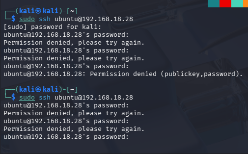
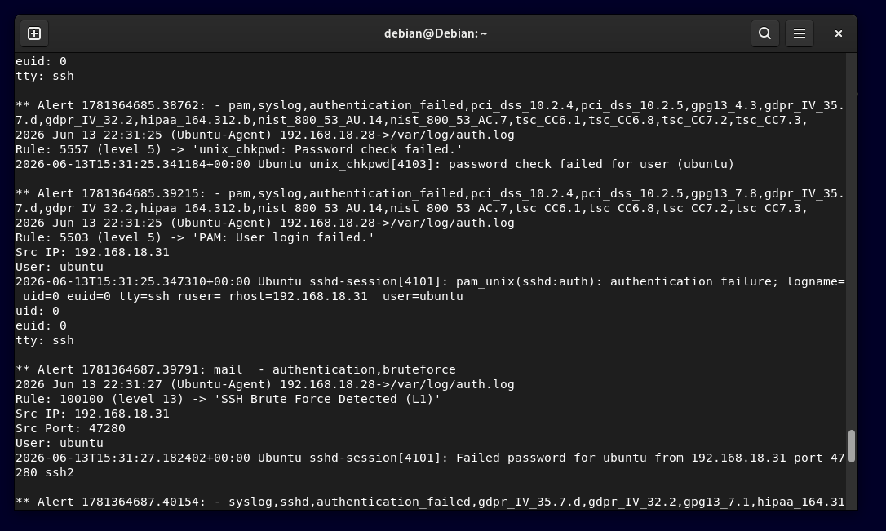
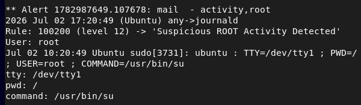
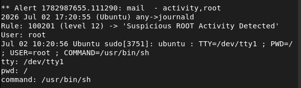
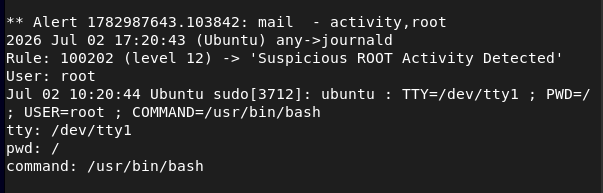
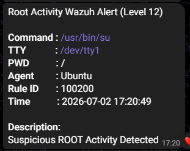
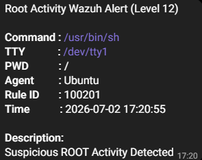
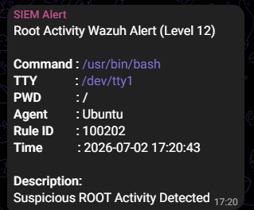

# SIEM Lab Demo Walkthrough

This document contains real attack simulation scenarios, detection results, and security response actions using Wazuh SIEM.

---

## 1. SSH Brute Force Attack Detection

### 📌 Scenario
A brute force attack was simulated using Kali Linux targeting the Ubuntu Server via SSH service.

### 🎯 Attack Method
- Repeated SSH login attempts using invalid credentials
- Automated login attempts from attacker machine (Kali Linux)

<p align="left"> 
 
</p>

### 🛡️ Detection
Wazuh detected multiple authentication failures based on predefined rules for SSH brute-force behavior.

### ⚡ Response
- Alert triggered in Wazuh Manager
- Active Response module executed automatic IP blocking
- Malicious IP added to firewall rules (iptables)

### 📸 Evidence

#### 1. Wazuh alert log (`alerts.log`)
Detection event generated by Wazuh after multiple failed SSH login attempts.

<p align="left"> 
 
</p>

#### 2. Authentication failure events
Failed authentication attempts observed on the Ubuntu endpoint.

<p align="left"> 
 
</p>

#### 3. Blocked IP from Active Response logs
Attacker IP automatically blocked after the configured threshold was exceeded.

<p align="left"> 
 
</p>

#### 4. Telegram Alert Notification
Telegram notification generated after SSH brute-force detection and Active Response execution.

<p align="left"> 
 
</p>

---

## 2. Root Activity Monitoring

### 📌 Scenario
A privileged shell execution was simulated on the monitored Ubuntu agent using `sudo` commands.

### 🎯 Attack Method
The following commands were executed to simulate root-level activity:

```bash
sudo su
sudo sh
sudo bash
```

<p align="left">
 
</p>

### 🛡️ Detection
A custom Wazuh rule monitors successful `sudo` executions and detects privileged shell commands.
Detected commands include:
- `sudo su`
- `sudo sh`
- `sudo bash`

### ⚡ Response
- Custom Wazuh rule triggered
- High-severity alert generated
- Alert forwarded to Telegram
- Command execution details included in the notification

### 📸 Evidence

#### 1. Root activity detected in Wazuh (`alerts.log`)
Detection generated after executing privileged shell commands.

<p align="left">
 
</p>
<p align="left">
 
</p>
<p align="left">
 
</p>

#### 2. Telegram Alert Notification
Telegram notification generated after privileged shell execution was detected by the custom Wazuh rule.

<p align="left">
 
 
 
</p>

## 3. (Future) Privilege Escalation Detection

### 🚧 Status
Planned enhancement for detecting privilege escalation techniques and high-risk administrative actions.

### 🎯 Goal
- Detect unauthorized privilege escalation attempts
- Monitor execution of high-risk administrative commands
- Classify alerts based on command severity
- Generate real-time Telegram notifications for critical events

---
