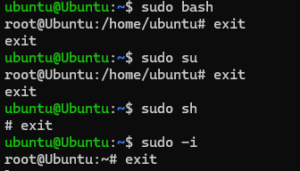
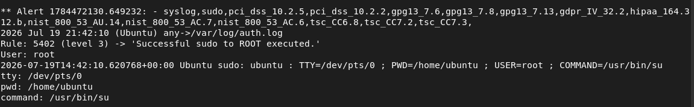
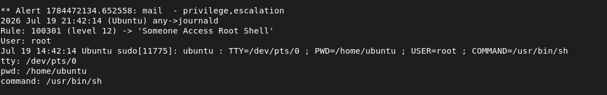
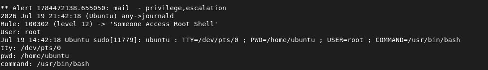
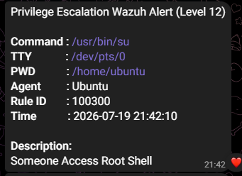
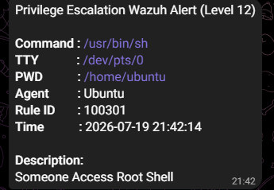
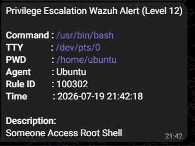

# Privilege Escalation

## Scenario
A privileged shell execution was simulated on the monitored Ubuntu agent using `sudo` commands.

---

## Why It Matters
Privilege escalation allows an attacker to gain elevated access and execute administrative commands, making it a critical stage in many Linux attacks.

---

## Attack Method
The following commands were executed to simulate root-level activity:

```bash
sudo su
sudo sh
sudo bash | sudo -i
```

<p align="left">
 
</p>

---

## Detection
A custom Wazuh rule monitors successful `sudo` executions and detects privileged shell activity.

| Item | Value |
|------------------|-------|
| Log Source | Journald |
| Detection Rule | Custom Privilege Escalation Rule |
| Rule ID | 100300–100302 |
| Detection Type | Privileged Shell Execution | 
| Monitored Commands | `su`, `sh`, `bash`, `sudo -i` |
| Alert Level | 12 |

---

## Response
After a privileged shell execution was detected:

- A high-severity Wazuh alert was generated.
- Command execution details were extracted from the event.
- A real-time Telegram notification was sent to the administrator.

---

## Evidence
### 1. Privilege Escalation detected in Wazuh (`alerts.log`)
Security alert generated after privileged shell execution.

<p align="left">
 
</p>
<p align="left">
 
</p>
<p align="left">
 
</p>

### 2. Telegram Alert Notification
Telegram notification generated after privileged shell execution was detected by the custom Wazuh rule.

<p align="left">
 
 
 
</p>
