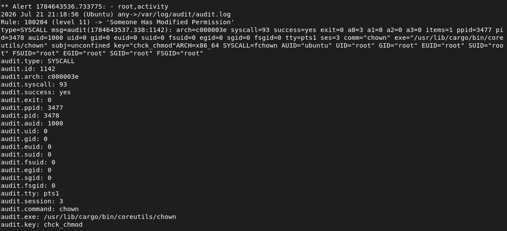

# Root Activity Monitoring

## Scenario
This scenario simulates common post-compromise administrative activities performed with elevated privileges, such as user management and critical system configuration changes.

---

## Why It Matters
Unauthorized administrative actions may indicate privilege abuse or post-compromise activity. Monitoring critical administrative commands helps detect persistence attempts, unauthorized account creation, and system configuration changes.

---

## Attack Method
The following privileged administrative commands were executed to simulate post-compromise activities:

```bash
sudo useradd
sudo passwd
sudo groupadd
sudo visudo
sudo chown
sudo chmod
```

<p align="left"> 
 
</p>

---

## Detection
Custom Wazuh rules monitor successful `sudo` executions and identify high-risk administrative commands associated with user management, privilege modification, and system configuration changes.

| Item | Value |
|------|-------|
| Log Source | Auditd |
| Detection Rule | Custom Root Activity Rules |
| Rule IDs | 100200–100204 |
| Detection Type | Root Activity Monitoring |
| Alert Level | 11 |

---

## Response
After a monitored administrative command was executed:

- A high-severity Wazuh alert was generated.
- Command execution details were collected from Auditd logs.
- A real-time Telegram notification was sent to the administrator.

---

## Evidence
### 1. Wazuh Alert (`alerts.log`)
Security alerts generated after executing monitored administrative commands.

### User Management
<p align="left">
 
</p>

### Password Management   
<p align="left">
 
</p>

### Group Management
<p align="left">
 
</p>

### Sudoers Modification
<p align="left">
 
</p>

### Ownership Change
<p align="left">
 
</p>

### Permission Change
<p align="left">
 
</p>

### 2. Telegram Alert Notification
Telegram notifications generated after monitored administrative commands were detected by the custom Wazuh rules.

<p align="left">
 
 
 
</p>

<p align="left">
 
 
 
</p>
