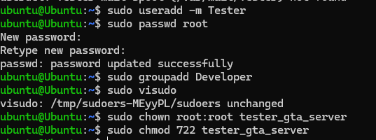
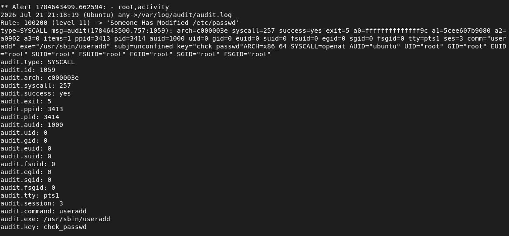
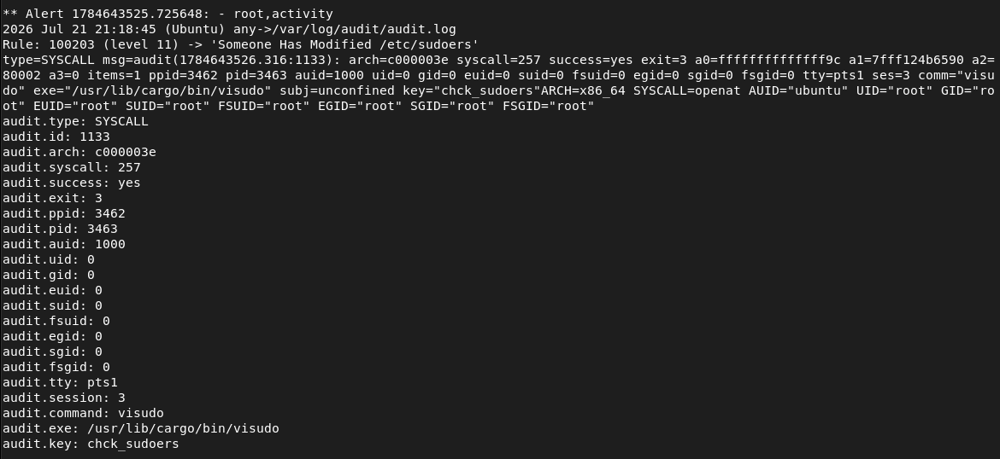
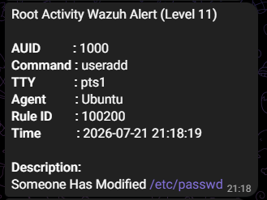
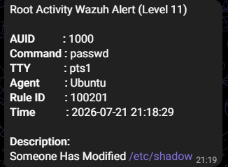
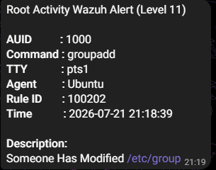
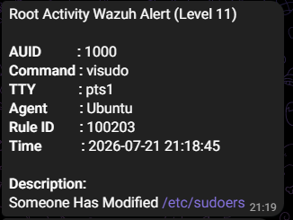
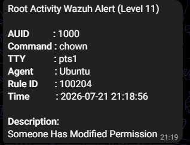
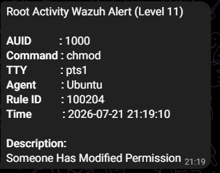

# Root Activity Monitoring

## 📌 Scenario
This scenario simulates privilege abuse and unauthorized administrative actions on a monitored Ubuntu endpoint. In a production infrastructure, users with high-level access (or attackers who have successfully escalated privileges) often manipulate system files, create persistent backdoor accounts, or modify critical file permissions to evade detection.

## 🎯 Attack Method
This simulation executes high-risk commands to replicate malicious post-compromise activities. It focuses on how an attacker spawns root shells, creates persistent accounts, and manipulates critical system files, allowing us to validate the detection capabilities and filtering efficiency of our monitoring system.

 
 

## 🛡️ Detection
A custom Wazuh rule monitors successful `sudo` executions and detects privileged root commands.
Detected commands include:
- `sudo useradd`
- `sudo passwd`
- `sudo groupadd`
- `sudo visudo`
- `sudo chwon`
- `sudo chmod`

## ⚡ Response
- Auditd Log
- Custom Wazuh rule triggered
- High-severity alert generated
- Alert forwarded to Telegram
- Command execution details included in the notification

## 📸 Evidence

### 1. Root Activity detected in Wazuh (`alerts.log`)
Alert logs generated immediately after executing privileged root commands.

### User Management

 

### Password Management   

 

### Group Management

 

### Sudoers Modification

 

### Ownership Change

 

### Permission Change

 

### 2. Telegram Alert Notification
Telegram notification generated after privileged root command was detected by the custom Wazuh rule.

 
 
 

 
 
 

