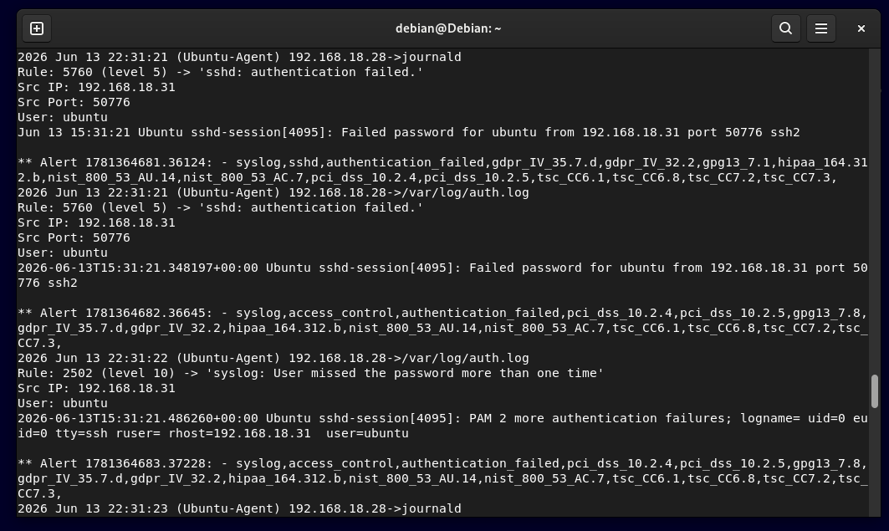
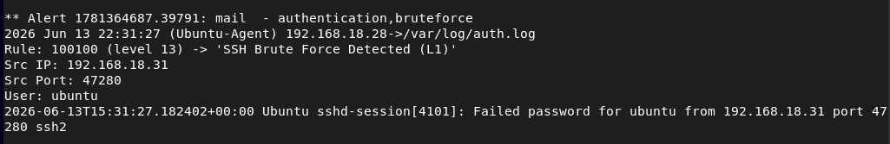
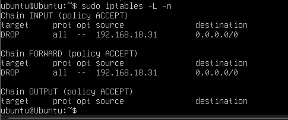
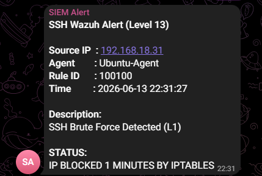

# SSH Brute Force Attack Detection

## Scenario
A brute force attack was simulated using Kali Linux targeting the Ubuntu Server via SSH service.

---

## Why It Matters
SSH brute-force attacks are one of the most common techniques used to gain unauthorized access to Linux systems by repeatedly guessing user credentials.

---

## Attack Method
- Repeated SSH login attempts using invalid credentials
- Automated login attempts from attacker machine (Kali Linux)

 
 

---
## Detection
Wazuh detected multiple authentication failures based on predefined rules for SSH brute-force behavior.

| Item | Value |
|------|-------|
| Log Source | `/var/log/auth.log` |
| Wazuh Rule | Built-in SSH authentication rules |
| Detection Type | Threshold-based |
| Alert Level | 10 |
| Active Response | Enabled |
---

## Response
- Alert triggered in Wazuh Manager
- Active Response module executed automatic IP blocking
- Malicious IP added to firewall rules (iptables)

---

## Evidence
### 1. SSH Brute Force detected in Wazuh (`alerts.log`)
Detection event generated by Wazuh after multiple failed SSH login attempts.

 
 

### 2. Authentication failure events
Failed authentication attempts observed on the Ubuntu endpoint.

 
 

### 3. Blocked IP from Active Response logs
Attacker IP automatically blocked after the configured threshold was exceeded.

 
 

### 4. Telegram Alert Notification
Telegram notification generated after SSH brute-force detection and Active Response execution.

 
 

